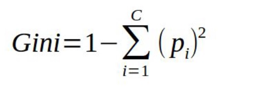

# Arboles-de-decision-Iris-Scikit-learn
1. Entrenar un árbol de decisión para el conjunto de datos de Iris.
2. Partir el conjunto Iris en dos: “entrenamiento” y “prueba”, dejando un 25% del conjunto
original para pruebas.
3. Imprimir la precisión (accuracy_score), para ambos conjuntos.
4. Graficar el árbol de decisión.
5. Volver a calcular el árbol cambiando el hiperparámetro: criterion para que use la entropía
en lugar de la impureza de Gini.

      a. ¿Cúal da mejor resultado?
   
      b. ¿Cambió el tiempo de entrenamiento?
7. Entrenar un modelo RandomForest
   
      a. Calcular la precision
   
      b. Calcular la matriz de confusión
   
      c. Comparar con los árboles anteriores
   
      d. Cambiar el hiperparámetro n_estimators dejarlo igual 10.
   
            i. ¿Mejoró o empeoró el modelo?
   
            ii. ¿Cambió el tiempo de entrenamiento?

Este es el resultado esperado del enunciado. Si bien no dio eso, lo que me dio, se aproxima bastante a lo pedido en el enunciado del ejercicio.

Explicación "bajada a tierra" de los resultados y como clasifica el árbol: 
Para este caso se usó como criterio la llamada "impureza de Gini". Este criterio es un tipo de medida de cuan cuán a menudo un elemento elegido
aleatoriamente del conjunto sería etiquetado incorrectamente si fue etiquetado de
manera aleatoria de acuerdo a la distribución de las etiquetas en el subconjunto.

## Nota sobre la diferencia con el resultado esperado
El árbol graficado difiere del ejemplo de referencia porque se entrenó sobre 
el conjunto de entrenamiento (112 muestras, tras el split 75/25) en vez del 
dataset completo (150 muestras). Esto es consistente con buenas prácticas de 
ML (evitar evaluar con datos ya vistos en entrenamiento), aunque diverge del 
orden de pasos sugerido en el enunciado original. Se optó por priorizar la 
metodología correcta de validación por sobre la réplica exacta del resultado 
esperado.
